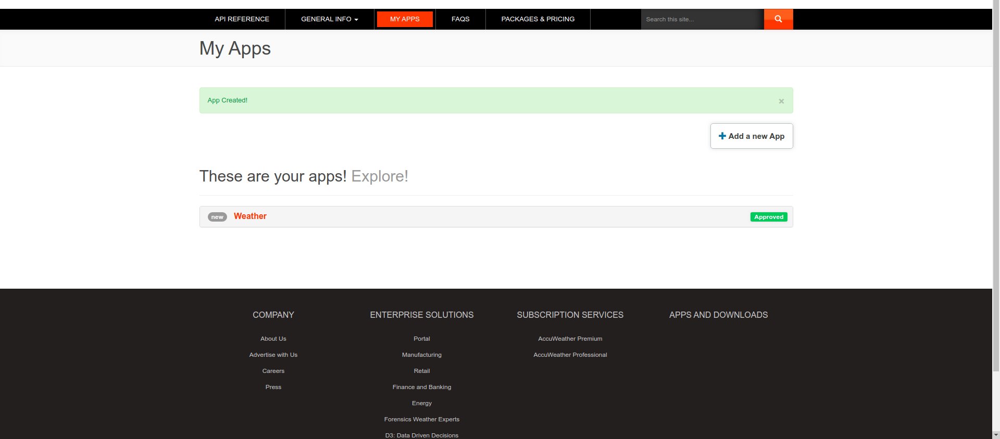
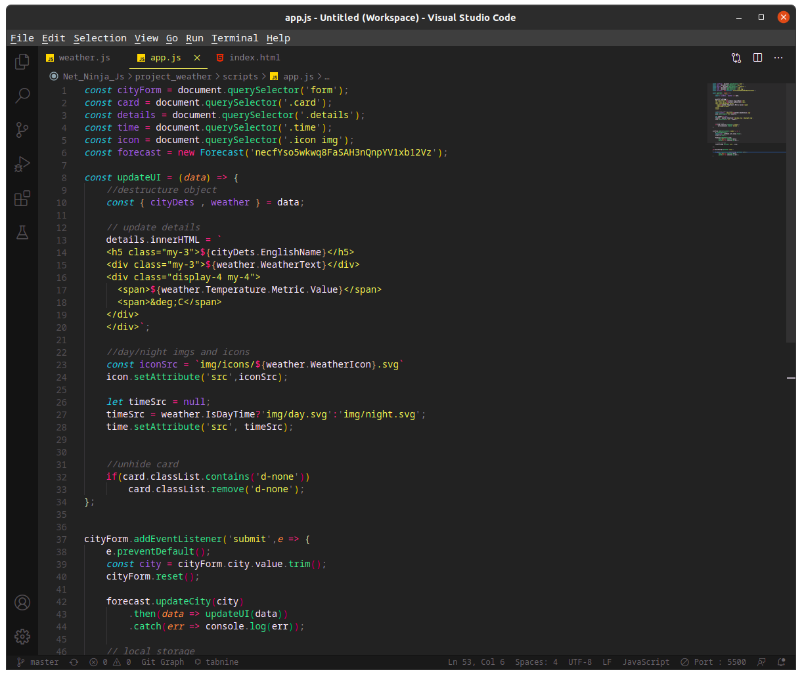
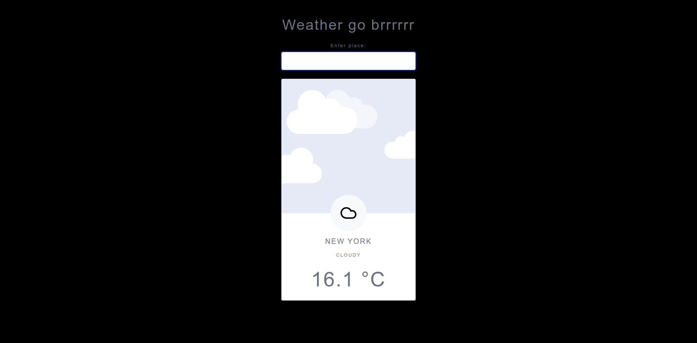
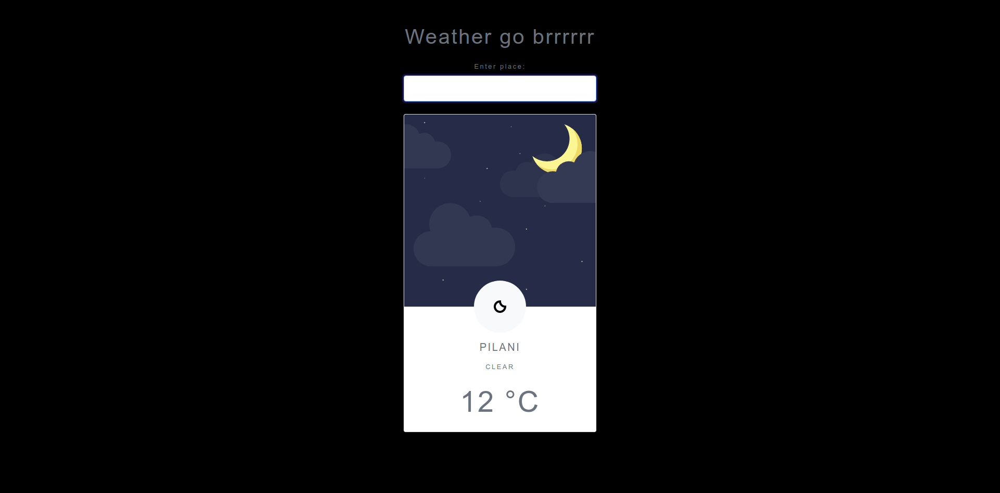

# WeatherGoBrrrrr

Just a simple web app that gives info on the weather of any given location.  

The weather API used in the app is from [AccuWeather APIs](https://developer.accuweather.com).  

To use this app, you will need a valid API key from their site linked above.  

Register with their site and then go to __MY APPS__ and then __Add a new app__.  




Add your API key in the app.js file. It's an argument to create a Forecast(class) instance.  
```const forecast = new Forecast('key goes here');```  




### Preview of the website  

#### Day  
  

#### Night  
  
